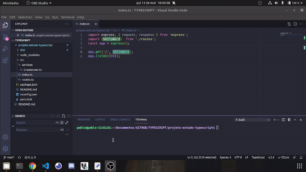

# Anotações

- yarn init -y
- yarn add typescript -D
- yarn add express
- yarn add -D @types/express -D
- node nao executa arquivos typescript, logo precisamos transformar o arquivo .ts para .js pro node executar
- yarn tsc src/index.ts
- criar um tsconfig para informar as opções de conversão de arquivos .ts em .js
    - yarn tsc --init
- yarn tsc
- node src/index.js
- descomentar a linha "outDir": do tsconfig e colocar o diretorio para ./dsit
